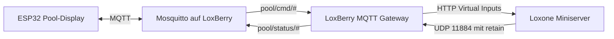

# Loxone-Anbindung über LoxBerry

Diese Anleitung beschreibt die Anbindung des Pool-Displays an Loxone über das
LoxBerry MQTT Gateway. Die native MQTT-Integration des Loxone Miniservers wird
in diesem Projekt nicht verwendet.

Der verbindliche Topic- und Payloadvertrag steht in [`mqtt.md`](mqtt.md).

## Architektur



Loxone bleibt die einzige Instanz, die Betriebszustände, Verriegelungen,
Grenzwerte und reale Ausgänge der Poolanlage bestimmt. Das Display sendet nur
Bedienwünsche. Ein Wunsch gilt erst als bestätigt, wenn Loxone anschließend den
tatsächlich aktiven Zustand über ein Statustopic veröffentlicht.

## Kommunikationswege

| Richtung | Transport | Standardport |
|---|---|---:|
| Display → Mosquitto | MQTT | TCP `1883` |
| Mosquitto → LoxBerry Gateway | interne MQTT-Subscription | - |
| LoxBerry Gateway → Miniserver | HTTP Virtual Inputs, empfohlen | HTTP(S)-Port des Miniservers |
| Miniserver → LoxBerry Gateway | UDP Virtual Output | UDP `11884` |

Das LoxBerry MQTT Gateway unterstützt alternativ UDP zum Miniserver auf Port
`11883`. Für eingehende Panelbefehle wird hier jedoch die vom LoxBerry-Projekt
empfohlene Übertragung über HTTP Virtual Inputs verwendet.

Referenzen:

- [LoxBerry: MQTT → Loxone](https://wiki.loxberry.de/konfiguration/widget_help/widget_mqtt/mqtt_gateway/mqtt_schritt_fur_schritt_mqtt_loxone?do=export_pdf)
- [LoxBerry: Loxone → MQTT](https://wiki.loxberry.de/konfiguration/widget_help/widget_mqtt/mqtt_gateway/mqtt_schritt_fur_schritt_loxone_mqtt?do=export_pdf)
- [LoxBerry: MQTT Gateway Troubleshooting](https://wiki.loxberry.de/en/konfiguration/widget_help/widget_mqtt/mqtt_gateway_faq/mqtt_gateway_troubleshooting_guide?do=export_pdf)

## Voraussetzungen

- Mosquitto und das MQTT Gateway laufen auf dem LoxBerry.
- Der Miniserver ist im LoxBerry-Miniserver-Widget eingerichtet.
- Der dort verwendete Loxone-Benutzer darf die benötigten virtuellen Eingänge
  schreiben.
- Das MQTT Gateway ist mit Mosquitto verbunden.
- LoxBerry und Miniserver besitzen feste IP-Adressen oder stabile lokale
  DNS-Namen.
- Port `11884/UDP` ist vom Miniserver zum LoxBerry erreichbar.

## Display mit Mosquitto verbinden

In der privaten Datei `include/PoolConfig.h`:

```cpp
#define MQTT_HOST       "IP_ODER_NAME_DES_LOXBERRY"
#define MQTT_PORT       1883
#define MQTT_USERNAME   "DISPLAY_BENUTZER"
#define MQTT_PASSWORD   "SICHERES_PASSWORT"
```

Das Display verwendet derzeit MQTT 3.1.1 über eine unverschlüsselte
`WiFiClient`-Verbindung. Port `1883` darf deshalb nur in einem vertrauenswürdigen
lokalen Netz erreichbar sein und darf nicht per Portweiterleitung ins Internet
geöffnet werden.

## Panelbefehle: MQTT → Loxone

### Subscription im MQTT Gateway

Im LoxBerry MQTT Gateway folgende Subscription anlegen:

```text
pool/cmd/#
```

Die Übertragung zum Miniserver auf HTTP Virtual Inputs einstellen. In der
`Incoming Overview` zeigt das Gateway die Namen an, unter denen die Werte in
Loxone ankommen. Schrägstriche im MQTT-Topic werden dabei üblicherweise durch
Unterstriche ersetzt.

### Virtuelle Eingänge in Loxone Config

Für jeden Befehl einen eigenen virtuellen Eingang anlegen. Die Bezeichnung
immer aus der LoxBerry `Incoming Overview` kopieren, statt sie manuell zu
erraten.

| MQTT-Topic | erwartete Bezeichnung | Typ | Payload |
|---|---|---|---:|
| `pool/cmd/mode` | `pool_cmd_mode` | analog | `1`, `2`, `3` |
| `pool/cmd/targetTemp` | `pool_cmd_targetTemp` | analog | `20.0` bis `32.0` |
| `pool/cmd/filterPump` | `pool_cmd_filterPump` | digital oder analog | `0`, `1` |

Die virtuellen Eingänge dürfen nicht direkt mit Aktoren verbunden werden. Der
Verarbeitungsweg lautet immer:

1. Payload empfangen
2. Wertebereich und Format prüfen
3. aktuellen Betriebsmodus und Anlagenfreigaben prüfen
4. Wunsch an die vorhandene Poollogik übergeben
5. tatsächlichen Zustand hinter allen Verriegelungen zurücklesen
6. diesen Zustand retained über LoxBerry veröffentlichen

### Betriebsmodus

| Wert | Panelmodus |
|---:|---|
| `1` | Automatik |
| `2` | Manuell |
| `3` | Aus |

- Nur die exakten ganzzahligen Werte `1`, `2` und `3` akzeptieren.
- Die Werte ausdrücklich auf die vorhandene Poollogik abbilden.
- Der offizielle Loxone-Baustein `Poolsteuerung` verwendet am Eingang `Om`
  `1 = Automatisch` und `2 = Service`. Diese Werte entsprechen den Panelmodi
  Automatik und Manuell. Panelmodus `3 = Aus` benötigt eine definierte
  Aus-/Sperrlogik und darf nicht ungeprüft als `Om = 3` weitergereicht werden.
- Erst den tatsächlich aktiven, auf das Panelmodell normalisierten Modus
  zurückmelden.

### Solltemperatur

- Nur im bestätigten Panelmodus `1 = Automatik` annehmen.
- Nur Werte von `20.0` bis `32.0` °C einschließlich annehmen.
- Nur Schritte von `0.5` °C annehmen.
- Den tatsächlich von der Poollogik übernommenen Sollwert zurückmelden.
- Dezimalwerte müssen mit Punkt übertragen werden, beispielsweise `29.5`.

### Filterpumpe

- Nur die Werte `0` und `1` annehmen.
- Nur im bestätigten Panelmodus `2 = Manuell` annehmen.
- Trockenlauf-, Ventil-, Wartungs- und weitere Anlagenverriegelungen bleiben
  zwingend in Loxone wirksam.
- Den tatsächlichen Pumpenausgang zurückmelden, nicht den virtuellen Eingang.

Ein abgelehnter Wunsch erzeugt keine künstliche Bestätigung. Das Display läuft
dann nach fünf Sekunden in den vorgesehenen Bestätigungs-Timeout.

## Statuswerte: Loxone → MQTT

### Virtuellen UDP-Ausgang anlegen

In Loxone Config einen virtuellen Ausgang für das MQTT Gateway anlegen:

```text
/dev/udp/IP_DES_LOXBERRY/11884
```

Darunter virtuelle Ausgangsbefehle für die sechs Statustopics anlegen. Das
LoxBerry-Schlüsselwort `retain` sorgt dafür, dass Mosquitto den letzten
bestätigten Wert speichert.

### Analoge Statuswerte

Für analoge Werte wird der Loxone-Platzhalter `<v>` verwendet:

```text
retain pool/status/waterTemp <v>
retain pool/status/targetTemp <v>
retain pool/status/mode <v>
```

### Digitale Statuswerte

Für digitale Ausgangsbefehle jeweils einen Ein- und Aus-Befehl konfigurieren.
Beispiel Filterpumpe:

```text
Befehl bei EIN: retain pool/status/filterPump 1
Befehl bei AUS: retain pool/status/filterPump 0
```

Dasselbe Prinzip gilt für:

```text
pool/status/heatingPump
pool/status/heatingAllowed
```

### Signalquellen

| Statustopic | Quelle in Loxone |
|---|---|
| `pool/status/waterTemp` | gemessene Wassertemperatur |
| `pool/status/targetTemp` | tatsächlich aktiver Sollwert |
| `pool/status/filterPump` | tatsächlicher Filterpumpenausgang |
| `pool/status/heatingPump` | tatsächlicher Heizpumpenausgang |
| `pool/status/heatingAllowed` | Freigabe der Heizungslogik |
| `pool/status/mode` | normalisierter, tatsächlich aktiver Panelmodus |

## Retain und Statusaktualisierung

Alle sechs Statustopics müssen mit `retain` veröffentlicht werden. Die drei
Befehlstopics dürfen niemals retained sein.

Retain liefert dem Display nach Neustart oder MQTT-Reconnect sofort den letzten
von Loxone bestätigten Zustand. Loxone muss einen Status bei tatsächlichen
Änderungen publizieren; eine zyklische Wiederholung ist nicht erforderlich.

Das Display verwendet einen bekannten retained Wert, solange MQTT verbunden
ist. Fällt nur Loxone aus, während Broker und Display verbunden bleiben, kann
ein Bedienwunsch noch gesendet werden. Ohne passende Statusantwort verändert
das Display seinen Zustand nicht und zeigt nach fünf Sekunden einen Timeout.
Loxone bleibt für Validierung, Verriegelungen und reale Ausgänge verantwortlich.

## Broker- und Netzwerksicherheit

- Für das Display einen eigenen MQTT-Benutzer verwenden.
- Anonyme Brokeranmeldung deaktivieren.
- Mosquitto nicht aus dem Internet erreichbar machen.
- LoxBerry, Miniserver und Display in einem vertrauenswürdigen lokalen Netz
  betreiben.
- Wenn ACLs eingesetzt werden, benötigt das Display:
  - Leserechte auf `pool/status/#`
  - Schreibrechte auf `pool/cmd/#` und `pool/display/#`
- Zugangsdaten ausschließlich in der ignorierten `PoolConfig.h` speichern.

## Inbetriebnahme ohne reale Aktoren

Die ersten Tests bei gesperrten oder simulierten Poolaktoren durchführen.

1. Im MQTT Gateway die Subscription `pool/cmd/#` aktivieren.
2. Einen Testwert veröffentlichen und in der Incoming Overview prüfen.
3. Den dort angezeigten Namen als virtuellen Eingang in Loxone anlegen.
4. Im Loxone LiveView prüfen, ob der Wert ankommt.
5. Einen virtuellen Ausgangsbefehl mit `retain` an Port `11884` senden.
6. Mit MQTT Explorer oder `mosquitto_sub` prüfen, ob das Statustopic erscheint.
7. Einen neuen Subscriber verbinden und prüfen, ob der Wert sofort retained
   zugestellt wird.
8. Alle gültigen und ungültigen Befehlsfälle prüfen.
9. Broker und Miniserver neu starten und den Wiederanlauf prüfen.
10. Nach einem Display- oder Broker-Neustart kontrollieren, dass alle letzten
    Statuswerte sofort retained zugestellt werden.

Zum Beobachten aller Pooltopics:

```sh
mosquitto_sub -h IP_DES_LOXBERRY -u USER -P PASSWORD -t 'pool/#' -v
```

Testbefehle nur bei sicher stillgelegten oder simulierten Aktoren senden:

```sh
mosquitto_pub -h IP_DES_LOXBERRY -u USER -P PASSWORD \
  -t pool/cmd/mode -m 1
```

## Abnahmekriterien

Die Anbindung ist bereit für das Display, wenn:

- alle Topicnamen und Payloadformate exakt [`mqtt.md`](mqtt.md) entsprechen,
- alle sechs Statuswerte retained und bei tatsächlichen Änderungen erscheinen,
- ungültige oder unzulässige Befehle keine Anlagenänderung bewirken,
- gültige Befehle innerhalb von fünf Sekunden durch den tatsächlichen Status
  bestätigt werden,
- ein Brokerausfall die Bedienung deaktiviert und ein Loxone-Ausfall zu einem
  Bestätigungs-Timeout führt,
- Loxone auch ohne Display vollständig und sicher weiterarbeitet.
