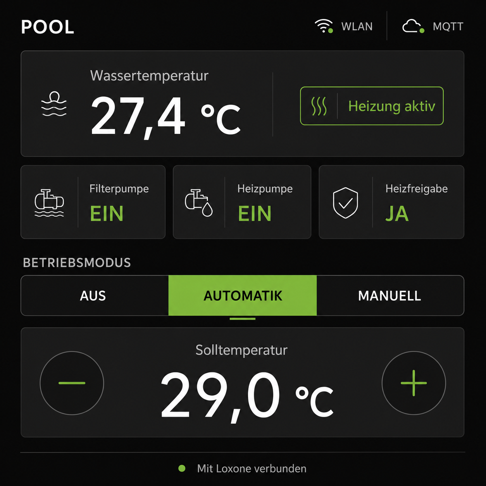

# UI concept

The approved design direction is inspired by the current Loxone App without
copying an existing screen or using Loxone branding.

## Visual language

- Canvas: 480 x 480 pixels
- Background: near-black charcoal
- Cards: slightly lighter charcoal with subtle borders
- Primary text: white
- Secondary text: muted light gray
- Active and positive state: bright lime green
- Warning: amber
- Error, timeout, or offline state: red
- Spacing: consistent 8-pixel grid
- Large touch targets with clear separation
- Flat appearance without gradients or decorative effects

Exact colors and font sizes will be finalized after the Waveshare
ESP32-S3-Touch-LCD-4B has been visually tested.

## Main screen

The main screen contains:

1. Header with title and Wi-Fi/MQTT status
2. Current water temperature
3. Separate `isHeating` information
4. Filter pump, heating pump, and heating permission status
5. Operating modes: Off, Automatic, and Manual
6. Target temperature with minus and plus buttons
7. Connection or warning message

Heating is never shown as an operating mode.

## Interaction rules

- Operating modes are enabled only with current Loxone data and MQTT.
- Target temperature is adjustable only in Automatic mode.
- Target range is 20.0 to 32.0 degrees Celsius in 0.5-degree steps.
- Filter pump control is enabled only in Manual mode.
- All commands remain pending until Loxone confirms the requested status.
- Pending commands show `Wird übernommen ...`.
- Confirmed commands show `Übernommen` for three seconds.
- A timeout shows `Keine Bestätigung von Loxone`.
- The affected control remains disabled while its command is pending.
- Unknown values display `--` instead of defaults.
- Stale values remain visible but are marked as outdated and controls are
  disabled.
- Offline state disables all command controls.

## Screen power behavior

The wall display should not stay fully lit permanently.

- After 60 seconds without touch input, the backlight is dimmed to a low level.
- After 5 minutes without touch input, the backlight may be switched off.
- A touch while dimmed or off wakes the display only and must not trigger a
  pool command.
- Once awake, the next touch is handled normally.
- The screen-power logic is independent from pool control. It changes only
  display brightness and touch forwarding, never `PoolState`.
- Critical warnings may wake the screen later, but this should be used
  sparingly to avoid unwanted light at night.

## Manual mode variation

When Manual mode is selected:

- The target-temperature buttons are disabled.
- The Filter pump status tile becomes an interactive on/off control.
- Heating status, heating pump, and heating permission remain informational.

## Automatic mode variation

When Automatic mode is selected:

- Target-temperature controls are enabled.
- Filter pump remains informational and cannot be switched manually.

## Implementation boundary

The future LVGL screen reads `PanelViewModel` for control availability,
warnings, and command progress. It must not duplicate permission rules or
modify `PoolState` directly.

Backlight and touch wake behavior should use `ScreenPowerPolicy`. Hardware
drivers translate its brightness percentage to the real backlight PWM or
enable pin.

## Current implementation status

The main-screen widget tree is implemented in `lib/Gui/GuiManager.cpp` using
LVGL 8.4. It includes status cards, mode buttons, target-temperature controls,
connection warnings, MQTT command callbacks, and command-progress feedback.

The GUI is compiled but not started yet. `GuiManager::begin()` may only be
called after the real display driver has initialized LVGL and registered a
display. Display flush, touch input, backlight, and panel timing remain
deliberately disabled until the Waveshare driver setup has been ported and
tested on the delivered panel.
